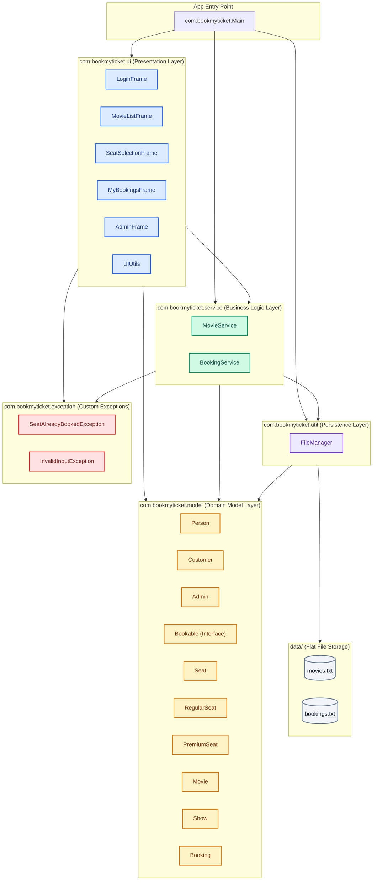

# Package Diagram: Book My Ticket

The following Mermaid diagram visualizes the layered package architecture and dependency relationships of the Book My Ticket application.

```mermaid
flowchart TD
    classDef uiLayer fill:#DBEAFE,stroke:#2563EB,stroke-width:2px,color:#1E3A8A;
    classDef serviceLayer fill:#D1FAE5,stroke:#059669,stroke-width:2px,color:#064E3B;
    classDef modelLayer fill:#FEF3C7,stroke:#D97706,stroke-width:2px,color:#78350F;
    classDef utilLayer fill:#EDE9FE,stroke:#7C3AED,stroke-width:2px,color:#4C1D95;
    classDef excLayer fill:#FEE2E2,stroke:#DC2626,stroke-width:2px,color:#7F1D1D;
    classDef dataLayer fill:#F1F5F9,stroke:#64748B,stroke-width:2px,color:#0F172A;

    subgraph EntryPoint ["App Entry Point"]
        Main["com.bookmyticket.Main"]
    end

    subgraph UI ["com.bookmyticket.ui (Presentation Layer)"]
        LoginFrame["LoginFrame"]
        MovieListFrame["MovieListFrame"]
        SeatSelectionFrame["SeatSelectionFrame"]
        MyBookingsFrame["MyBookingsFrame"]
        AdminFrame["AdminFrame"]
        UIUtils["UIUtils"]
    end
    class UI,LoginFrame,MovieListFrame,SeatSelectionFrame,MyBookingsFrame,AdminFrame,UIUtils uiLayer;

    subgraph Service ["com.bookmyticket.service (Business Logic Layer)"]
        MovieService["MovieService"]
        BookingService["BookingService"]
    end
    class Service,MovieService,BookingService serviceLayer;

    subgraph Model ["com.bookmyticket.model (Domain Model Layer)"]
        Person["Person"]
        Customer["Customer"]
        Admin["Admin"]
        Bookable["Bookable (Interface)"]
        Seat["Seat"]
        RegularSeat["RegularSeat"]
        PremiumSeat["PremiumSeat"]
        Movie["Movie"]
        Show["Show"]
        Booking["Booking"]
    end
    class Model,Person,Customer,Admin,Bookable,Seat,RegularSeat,PremiumSeat,Movie,Show,Booking modelLayer;

    subgraph Util ["com.bookmyticket.util (Persistence Layer)"]
        FileManager["FileManager"]
    end
    class Util,FileManager utilLayer;

    subgraph Exception ["com.bookmyticket.exception (Custom Exceptions)"]
        SeatAlreadyBookedException["SeatAlreadyBookedException"]
        InvalidInputException["InvalidInputException"]
    end
    class Exception,SeatAlreadyBookedException,InvalidInputException excLayer;

    subgraph Data ["data/ (Flat File Storage)"]
        MoviesFile[("movies.txt")]
        BookingsFile[("bookings.txt")]
    end
    class Data,MoviesFile,BookingsFile dataLayer;

    %% Dependencies
    Main --> UI
    Main --> Service
    Main --> Util

    UI --> Service
    UI --> Model
    UI --> Exception

    Service --> Model
    Service --> Util
    Service --> Exception

    Util --> Model
    Util --> Data
```
